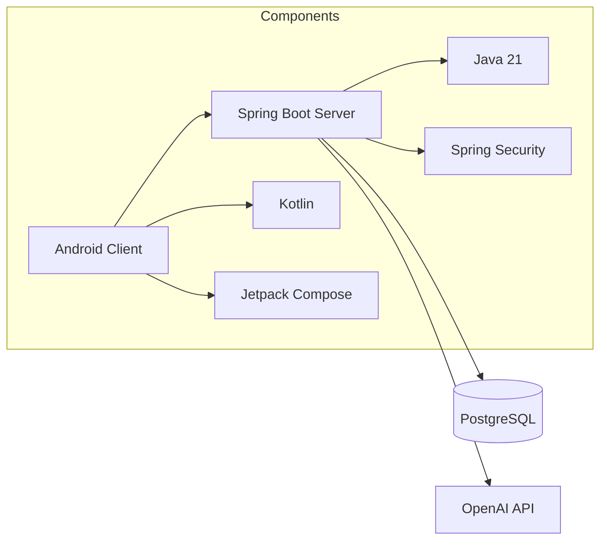

# "TimeTamer" SmartCalendar
**"TimeTamer" SmartCalendar** is an Android productivity app with gamification elements that helps users manage tasks, track progress, and stay motivated through achievements.

## Key Features
- **Task Management**: Create, edit, complete, and delete categorized tasks
- **Progress Tracking**: 
  - Daily/weekly statistics
  - Streak counters
  - Time tracking
- **Achievement System**:
  - Completion streaks
  - Task diversity badges
  - Time-based milestones
- **Smart Reminders**: Customizable notifications with pre-task alerts
- **User Profiles**: Secure login/registration with profile customization

  
  
  
  

---

## Project Architecture

---

## Repository Structure
| Component | Repository | Tech Stack | Documentation |
|-----------|------------|------------|---------------|
| **Android Client** | [SmartCalendar-Android](https://github.com/hse-project-Java-2025/client) | Kotlin, Jetpack Compose | [Client README]() |
| **Backend Server** | [SmartCalendar-Server](https://github.com/hse-project-Java-2025/server) | Java 21, Spring Boot, PostgreSQL | [Server README](https://github.com/hse-project-Java-2025/server/blob/main/README.md) |

---

## Contributors
- [Pavel Usatov](https://github.com/UsatovPavel)
- [Timofey Ustinov](https://github.com/timustinov)
- [Dmitry Rusanov](https://github.com/DimaRus05)
- [Mikhail Minaev](https://github.com/minmise)

---

## License
Distributed under the MIT License - see [LICENSE](LICENSE) for details
